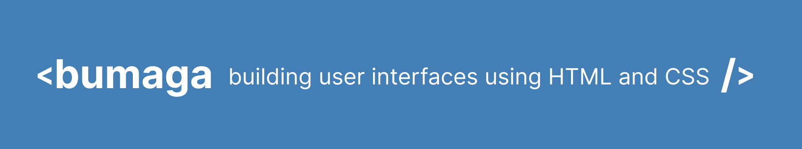

A Rust-native library for building user interfaces using web development experience.
You should use it if these features valuable to you:

+ UI declaration and styling language similar to HTML and CSS
+ Hot reloading of view, prototyping without recompilation Rust app
+ Simple view bindings and interoperability based on JSON values
+ Graphics API agnostic
+ Windowing API agnostic
+ (TODO) CSS animations

The development of this library possible thanks to work of Rust enthusiasts:
[servo](https://github.com/servo/servo),
[taffy](https://github.com/DioxusLabs/taffy),
[lightningcss](https://github.com/parcel-bundler/lightningcss), other 🔥 🚀

## What it is not

+ Not a HTML/CSS/script engine or full spec implemenation (look [sciter](https://github.com/sciter-sdk/rust-sciter) if
  you need)
+ Not a drawing solution, just abstract drawing instructions in result
+ Not a text rendering engine (actually you should provide one for correct work)

## Example

TODO: short description of architecture and real code example

```rust
fn main() {
    let mut engine = MyEngine::startup();
    let mut name = String::from("Alice");
    let component = Component::compile("index.html", "style.css");
    loop {
        let value = json!({"name": name});
        let input = Input::from(engine.input)
            .fonts(engine.fonts)
            .value(value);
        let frame = component.update(input);
        if let Some(arg) = frame.calls.get("rename") {
            name = arg.to_string()
        }
        for element in frame.elements {
            engine.draw(element);
        }
    }
}
```

```html

<div>
    <h1>Hello, {name}!</h1>
    <input value="name" onchange="rename"/>
</div>
```

```css
h1 {
    font-size: 20px;
    color: #2c2c2c;
}

input {

}
```

# More examples

Bumaga doesn't implement drawing, doesn't limit your application
with any details of concrete graphics API.
But here few examples with popular graphics solutions witch
should help to understand how it works:

* WIP: [Skia+Metal+Winit](examples/skia-metal-winit-app)
* [SDL2](examples/sdl2-app)
* TODO: Vulkan
* [macroquad](examples/macroquad-app)


